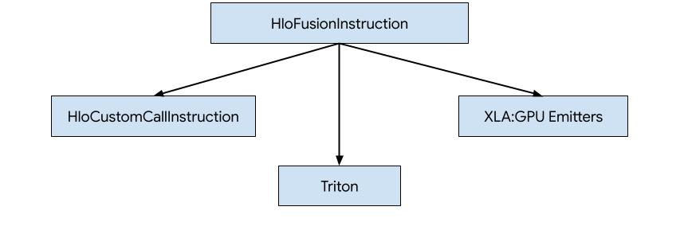
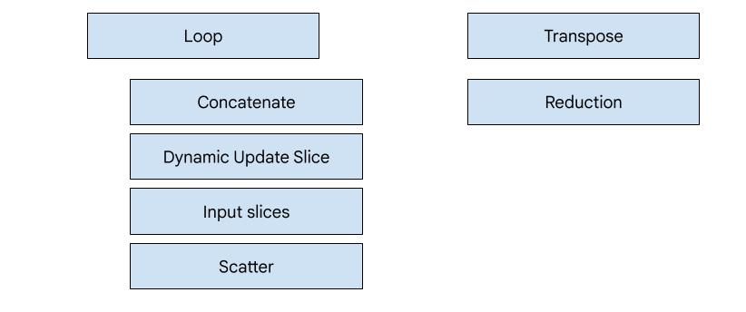
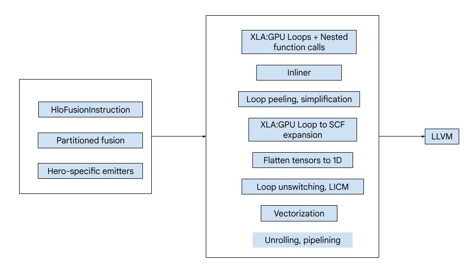
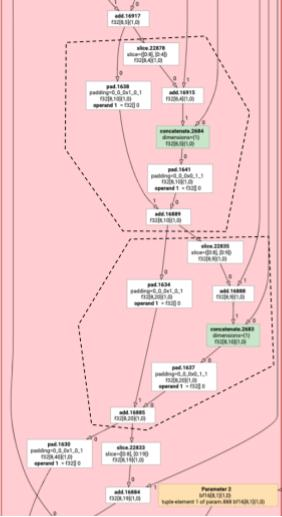
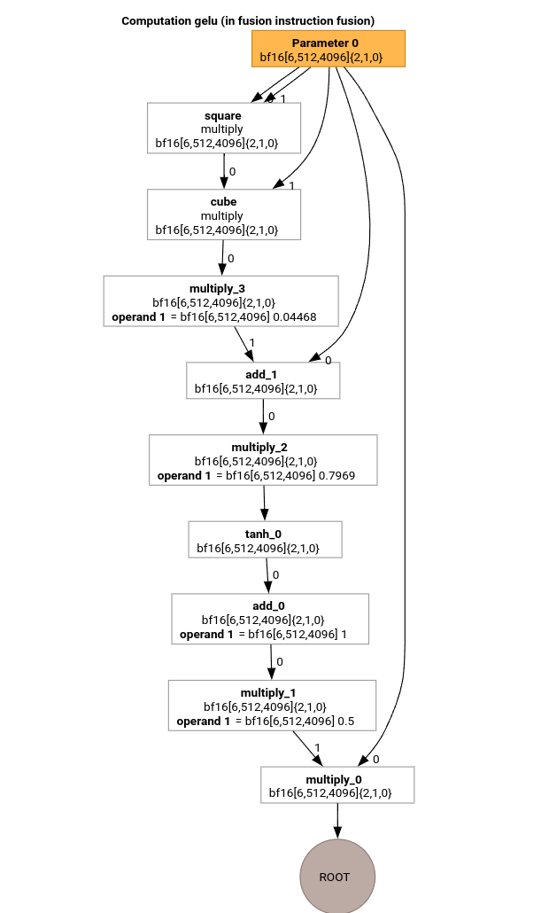
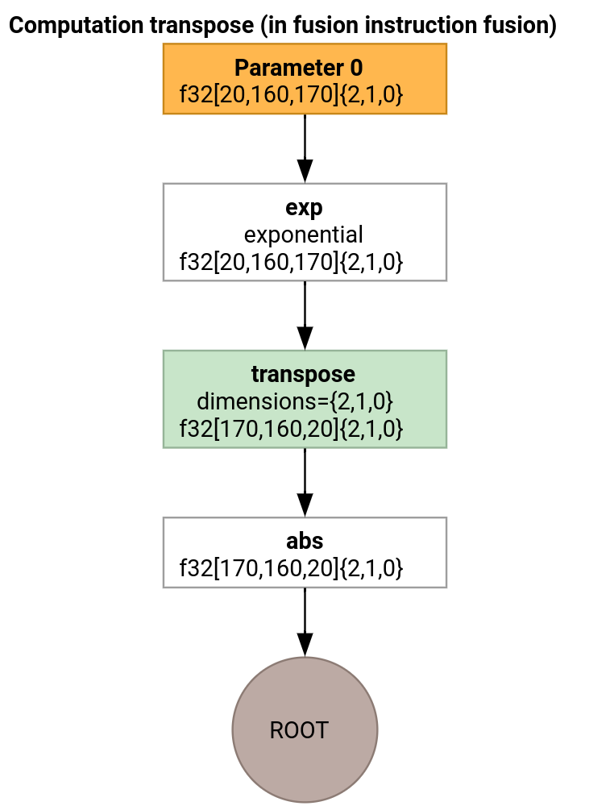

# XLA:GPU 发射器
XLA:GPU 中有三种为 HLO 生成代码的方式。



1. 将 HLO 替换为对外部库的自定义调用，例如[NVidia cuBLAS](https://developer.nvidia.com/cublas), [cuDNN](https://developer.nvidia.com/cudnn).
2. 将 HLO 平铺到块级别，然后使用 [OpenAI Triton](https://openai.com/index/triton/).
3. 使用 XLA 发射器逐步将 HLO 降低为 LLVM IR。

本文档聚焦于 XLA:GPU 发射器。


## 基于主角的代码生成

XLA:GPU 中有 7 种发射器类型。每种发射器类型对应融合中的一个“主角”，即融合计算中最重要的操作，它塑造了整个融合的代码生成。



例如，如果融合中存在 `HloTransposeInstruction`，且需要使用共享内存来改善内存读写模式，则会选择转置发射器。规约发射器使用洗牌（shuffles）和共享内存生成规约。循环发射器是默认发射器。如果融合没有我们拥有特殊发射器的主角，则会使用循环发射器。

## 高级概述

代码由以下主要构建块组成：

- 计算分区器——将 HLO 融合计算拆分为多个函数
- 发射器——将分区的 HLO 融合转换为 MLIR (`xla_gpu`, `tensor`, `arith`, `math`, `scf` dialects)
- 编译管道——优化 IR 并将其降低到 LLVM



## 分区

参见 [computation_partitioner.h](https://github.com/openxla/xla/blob/ca62f3e1bc9ea1d808c3a4de0a78bae7453389eb/xla/codegen/emitters/computation_partitioner.h).

非逐元素的 HLO 指令并不总能一起发射。考虑以下 HLO 图：

```
     param
       |
      log
      |  \
      |  transpose
      |  /
      add
```

如果我们在一个函数中发射这些指令，那么对于 `log` 的每个元素， `add`会在两个不同的索引处被访问。旧的发射器通过生成两次 `log` 来解决这个问题。对于这个特定的图，这不是问题，但当存在多个拆分时，代码大小会呈指数级增长。

在这里，我们通过将图划分为可以安全地作为一个函数发射的片段来解决这个问题。标准是：

- 只有一个使用者的指令可以安全地与它的使用者一起发射。
- 有多个使用者的指令，如果所有使用者通过相同的索引访问它，则可以安全地与它们的使用者一起发射。

在上面的例子中， `add` 和 `tranpose` 访问`log`的不同索引，因此与它们一起发射是不安全的。

因此，该图被划分为三个函数（每个函数仅包含一个指令）。

同样的原则也适用于以下带有 `slice` 和 `pad` 的 `add`的例子。



## 元素级发射

参见 [elemental_hlo_to_mlir.h](https://github.com/openxla/xla/blob/ca62f3e1bc9ea1d808c3a4de0a78bae7453389eb/xla/codegen/emitters/elemental_hlo_to_mlir.h).

元素级发射为`HloInstructions`创建循环和数学/算术操作。大多数情况下，这是直接的，但这里有一些有趣的事情。

### 索引变换

一些指令 (`transpose`, `broadcast`, `reshape`, `slice`, `reverse` 以及一些其他指令) 纯粹是索引上的变换：要产生结果的一个元素，我们需要产生输入的某个其他元素。为此，我们可以重用 XLA 的 [indexing_analysis](https://openxla.org/xla/indexing)它提供了为指令生成输出到输入映射的函数。
例如，对于从 `[20,40]` 到 `[40,20]` 的 `transpose`,它将产生以下索引映射（每个输入维度一个仿射表达式；d0 和 d1 是输出维度）：

```
  (d0, d1) -> d1
  (d0, d1) -> d0
```

因此，对于这些纯索引变换指令，我们可以简单地获取映射，将其应用于输出索引，并在得到的索引处产生输入。

类似地， `pad` 操作的大部分实现使用了索引映射和约束。 `pad` 也是一种索引变换，并附加了一些检查以确定我们是返回输入元素还是填充值。

### 元组

我们不支持内部的 `tuple`。我们也不支持嵌套元组输出。所有使用这些特性的 XLA 图都可以转换为不使用的图。

### Gather
我们只支持由[`gather_simplifier`](https://github.com/openxla/xla/blob/main/xla/hlo/transforms/simplifiers/gather_simplifier.h)生成的规范化的 gather。

## 子图函数

对于一个计算的子图，其参数为 `%p0` 到 `%p_n`，子图根节点具有 `r` 个维度和元素类型 (`e0` to `e_m`), 我们使用以下 MLIR 函数签名：

``````
(%p0: tensor<...>, %p1: tensor<...>, ..., %pn: tensor<...>,
 %i0: index, %i1: index, ..., %i_r-1: index) -> (e0, ..., e_m)
``````

也就是说，每个计算参数对应一个张量输入，每个输出维度对应一个索引输入，每个输出对应一个结果。

要发射一个函数，我们只需使用上面的元素级发射器，并递归地发射其操作数，直到到达子图的边缘。然后，我们：为参数发射`tensor.extract` 或为其他子图发射 `func.call`。

## 入口函数

每种发射器类型在生成入口函数（即针对主角的函数）时有所不同。入口函数与上面的函数不同，因为它没有索引作为输入（只有线程 ID 和块 ID），并且实际上需要将输出写入某个地方。对于循环发射器，这相当直接，但转置和规约发射器具有非平凡的写入逻辑。
入口计算的签名是：

```
(%p0: tensor<...>, ..., %pn: tensor<...>,
 %r0: tensor<...>, ..., %rn: tensor<...>) -> (tensor<...>, ..., tensor<...>)
```

与之前一样， `%pn`是计算的参数，`%rn`是计算的结果。入口计算将结果作为张量，通过`tensor.insert`将更新插入其中，然后返回它们。不允许对输出张量有其他用途。

## 编译管道

### 循环发射器

参见 [loop.h](https://github.com/openxla/xla/blob/cfd16b7f21feff17635c782f4489c0f478178eb9/xla/backends/gpu/codegen/emitters/loop.h#L4)。

让我们使用 GELU 函数的 HLO 来研究 MLIR 编译管道中最重要的几个 passes。



这个 HLO 计算只有逐元素操作、常量和广播。它将使用循环发射器发射。

#### MLIR 转换

转换为 MLIR 后，我们得到一个依赖`%thread_id_x` 和 `%block_id_x` 的 `xla_gpu.loop`，它定义了线性遍历输出所有元素的循环，以保证合并写入。

在此循环的每次迭代中，我们调用

```
   %pure_call = xla_gpu.pure_call @gelu(%input, %dim0, %dim1, %dim2)
      : (tensor<6x512x4096xbf16>, index, index, index) -> bf16
```

来计算根操作的元素。注意，我们只有一个为 `@gelu` 概述的函数，因为分区器没有检测到具有两种或更多不同访问模式的张量。

```
#map = #xla_gpu.indexing_map<"(th_x, bl_x)[vector_index] -> ("
 "bl_x floordiv 4096, (bl_x floordiv 8) mod 512, (bl_x mod 8) * 512 + th_x * 4 + vector_index),"
 "domain: th_x in [0, 127], bl_x in [0, 24575], vector_index in [0, 3]">

func.func @main(%input: tensor<6x512x4096xbf16> , %output: tensor<6x512x4096xbf16>)
   -> tensor<6x512x4096xbf16> {
 %thread_id_x = gpu.thread_id  x {xla.range = [0 : index, 127 : index]}
 %block_id_x = gpu.block_id  x {xla.range = [0 : index, 24575 : index]}

 %xla_loop = xla_gpu.loop (%thread_id_x, %block_id_x)[%vector_index] -> (%dim0, %dim1, %dim2)
     in #map iter_args(%iter = %output) -> (tensor<6x512x4096xbf16>) {
   %pure_call = xla_gpu.pure_call @gelu(%input, %dim0, %dim1, %dim2)
      : (tensor<6x512x4096xbf16>, index, index, index) -> bf16
   %inserted = tensor.insert %pure_call into %iter[%dim0, %dim1, %dim2] : tensor<6x512x4096xbf16>
   xla_gpu.yield %inserted : tensor<6x512x4096xbf16>
 }
 return %xla_loop : tensor<6x512x4096xbf16>
}

func.func private @gelu(%arg0: tensor<6x512x4096xbf16>, %i: index, %j: index, %k: index) -> bf16 {
  %cst = arith.constant 5.000000e-01 : bf16
  %cst_0 = arith.constant 1.000000e+00 : bf16
  %cst_1 = arith.constant 7.968750e-01 : bf16
  %cst_2 = arith.constant 4.467770e-02 : bf16
  %extracted = tensor.extract %arg0[%i, %j, %k] : tensor<6x512x4096xbf16>
  %0 = arith.mulf %extracted, %extracted : bf16
  %1 = arith.mulf %0, %extracted : bf16
  %2 = arith.mulf %1, %cst_2 : bf16
  %3 = arith.addf %extracted, %2 : bf16
  %4 = arith.mulf %3, %cst_1 : bf16
  %5 = math.tanh %4 : bf16
  %6 = arith.addf %5, %cst_0 : bf16
  %7 = arith.mulf %6, %cst : bf16
  %8 = arith.mulf %extracted, %7 : bf16
  return %8 : bf16
}
```

#### 内联器

在 `@gelu` 被内联后，我们得到一个单一的 `@main` 函数。可能会发生同一个函数被调用两次或更多次的情况。在这种情况下，我们不进行内联。关于内联规则的更多细节可以在[xla_gpu_dialect.cc](https://github.com/openxla/xla/blob/39fc9c0c3e06b29e27f2aebdb21fca15754de928/xla/backends/gpu/codegen/emitters/ir/xla_gpu_dialect.cc)中找到。

```
func.func @main(%arg0: tensor<6x512x4096xbf16>, %arg1: tensor<6x512x4096xbf16>) -> tensor<6x512x4096xbf16> {
 ...
  %thread_id_x = gpu.thread_id  x {xla.range = [0 : index, 127 : index]}
  %block_id_x = gpu.block_id  x {xla.range = [0 : index, 24575 : index]}

  %xla_loop = xla_gpu.loop (%thread_id_x, %block_id_x)[%vector_index] -> (%dim0, %dim1, %dim2)
      in #map iter_args(%iter = %output) -> (tensor<6x512x4096xbf16>) {
    %extracted = tensor.extract %input[%dim0, %dim1, %dim2] : tensor<6x512x4096xbf16>
    %0 = arith.mulf %extracted, %extracted : bf16
    %1 = arith.mulf %0, %extracted : bf16
    %2 = arith.mulf %1, %cst : bf16
    %3 = arith.addf %extracted, %2 : bf16
    %4 = arith.mulf %3, %cst_0 : bf16
    %5 = math.tanh %4 : bf16
    %6 = arith.addf %5, %cst_1 : bf16
    %7 = arith.mulf %6, %cst_2 : bf16
    %8 = arith.mulf %extracted, %7 : bf16
    %inserted = tensor.insert %8 into %iter[%dim0, %dim1, %dim2] : tensor<6x512x4096xbf16>
    xla_gpu.yield %inserted : tensor<6x512x4096xbf16>
  }
  return %xla_loop : tensor<6x512x4096xbf16>
}
```

#### `xla_gpu` 到 `scf` 转换

参见 [lower_xla_gpu_to_scf.cc](https://github.com/openxla/xla/blob/39fc9c0c3e06b29e27f2aebdb21fca15754de928/xla/backends/gpu/codegen/emitters/transforms/lower_xla_gpu_to_scf.cc).

`xla_gpu.loop`表示一个带有内部边界检查的循环嵌套。如果循环归纳变量超出了索引映射定义域的范围，则跳过该次迭代。这意味着该循环被转换为 1 个或多个嵌套的`scf.for` 操作，内部包含一个 `scf.if`。
```
%xla_loop = scf.for %vector_index = %c0 to %c4 step %c1 iter_args(%iter = %output) -> (tensor<6x512x4096xbf16>) {
   %2 = arith.cmpi sge, %thread_id_x, %c0 : index
   %3 = arith.cmpi sle, %thread_id_x, %c127 : index
   %4 = arith.andi %2, %3 : i1
   %5 = arith.cmpi sge, %block_id_x, %c0 : index
   %6 = arith.cmpi sle, %block_id_x, %c24575 : index
   %7 = arith.andi %5, %6 : i1
   %inbounds = arith.andi %4, %7 : i1
   %9 = scf.if %inbounds -> (tensor<6x512x4096xbf16>) {
     %dim0 = xla_gpu.apply_indexing #map(%thread_id_x,  %block_id_x)[%vector_index]
     %dim1 = xla_gpu.apply_indexing #map1(%thread_id_x, %block_id_x)[%vector_index]
     %dim2 = xla_gpu.apply_indexing #map2(%thread_id_x, %block_id_x)[%vector_index]
     %extracted = tensor.extract %input[%dim0, %dim1, %dim2] : tensor<6x512x4096xbf16>
     // ... more arithmetic operations
     %29 = arith.mulf %extracted, %28 : bf16
     %inserted = tensor.insert %29 into %iter[%dim0, %dim1, %dim2] : tensor<6x512x4096xbf16>
     scf.yield %inserted : tensor<6x512x4096xbf16>
   } else {
     scf.yield %iter : tensor<6x512x4096xbf16>
   }
   scf.yield %9 : tensor<6x512x4096xbf16>
 }
```

#### 展平张量

参见 [flatten_tensors.cc](https://github.com/openxla/xla/blob/39fc9c0c3e06b29e27f2aebdb21fca15754de928/xla/backends/gpu/codegen/emitters/transforms/flatten_tensors.cc).

N 维张量被投影到一维。这将简化向量化和降低到 LLVM 的过程，因为现在每个张量访问都对应于数据在内存中的对齐方式。

```
#map = #xla_gpu.indexing_map<"(th_x, bl_x, vector_index) -> (th_x * 4 + bl_x * 512 + vector_index),"
 "domain: th_x in [0, 127], bl_x in [0, 24575], vector_index in [0, 3]">

func.func @main(%input: tensor<12582912xbf16>, %output: tensor<12582912xbf16>) -> tensor<12582912xbf16> {
 %xla_loop = scf.for %vector_index = %c0 to %c4 step %c1 iter_args(%iter = %output) -> (tensor<12582912xbf16>) {
   %dim = xla_gpu.apply_indexing #map(%thread_id_x, %block_id_x, %vector_index)
   %extracted = tensor.extract %input[%dim] : tensor<12582912xbf16>
   %2 = arith.mulf %extracted, %extracted : bf16
   %3 = arith.mulf %2, %extracted : bf16
   %4 = arith.mulf %3, %cst_2 : bf16
   %5 = arith.addf %extracted, %4 : bf16
   %6 = arith.mulf %5, %cst_1 : bf16
   %7 = math.tanh %6 : bf16
   %8 = arith.addf %7, %cst_0 : bf16
   %9 = arith.mulf %8, %cst : bf16
   %10 = arith.mulf %extracted, %9 : bf16
   %inserted = tensor.insert %10 into %iter[%dim] : tensor<12582912xbf16>
   scf.yield %inserted : tensor<12582912xbf16>
 }
 return %xla_loop : tensor<12582912xbf16>
}
```

#### 向量化

参见 [vectorize_loads_stores.cc](https://github.com/openxla/xla/blob/39fc9c0c3e06b29e27f2aebdb21fca15754de928/xla/backends/gpu/codegen/emitters/transforms/vectorize_loads_stores.cc).

该 pass 分析 `tensor.extract` 和 `tensor.insert` 操作中的索引，如果它们是由 `xla_gpu.apply_indexing` 产生的，且该索引相对于 `%vector_index` 连续访问元素且访问是对齐的，那么 `tensor.extract` 会被转换为 `vector.transfer_read` 并提升到循环之外。

在这个特定例子中，有一个索引映射 `(th_x, bl_x, vector_index) -> (th_x * 4 + bl_x * 512 + vector_index)` 用于在从 0 到 4 的 `scf.for` 循环中计算要提取和插入的元素。因此，`tensor.extract` 和 `tensor.insert` 都可以被向量化。

```
func.func @main(%input: tensor<12582912xbf16>, %output: tensor<12582912xbf16>) -> tensor<12582912xbf16> {
 %vector_0 = arith.constant dense<0.000000e+00> : vector<4xbf16>
 %0 = xla_gpu.apply_indexing #map(%thread_id_x, %block_id_x, %c0)
 %2 = vector.transfer_read %input[%0], %cst {in_bounds = [true]} : tensor<12582912xbf16>, vector<4xbf16>
 %xla_loop:2 = scf.for %vector_index = %c0 to %c4 step %c1
     iter_args(%iter = %output, %iter_vector = %vector_0) -> (tensor<12582912xbf16>, vector<4xbf16>) {
   %5 = vector.extract %2[%vector_index] : bf16 from vector<4xbf16>
   %6 = arith.mulf %5, %5 : bf16
   %7 = arith.mulf %6, %5 : bf16
   %8 = arith.mulf %7, %cst_4 : bf16
   %9 = arith.addf %5, %8 : bf16
   %10 = arith.mulf %9, %cst_3 : bf16
   %11 = math.tanh %10 : bf16
   %12 = arith.addf %11, %cst_2 : bf16
   %13 = arith.mulf %12, %cst_1 : bf16
   %14 = arith.mulf %5, %13 : bf16
   %15 = vector.insert %14, %iter_vector [%vector_index] : bf16 into vector<4xbf16>
   scf.yield %iter, %15 : tensor<12582912xbf16>, vector<4xbf16>
 }
 %4 = vector.transfer_write %xla_loop#1, %output[%0] {in_bounds = [true]}
     : vector<4xbf16>, tensor<12582912xbf16>
 return %4 : tensor<12582912xbf16>
}
```

#### 循环展开

参见 [optimize_loops.cc](https://github.com/openxla/xla/blob/39fc9c0c3e06b29e27f2aebdb21fca15754de928/xla/backends/gpu/codegen/emitters/transforms/optimize_loops.cc).

循环展开会寻找可以展开的 `scf.for` 循环。在这种情况下，对向量元素的循环消失了。

```
func.func @main(%input: tensor<12582912xbf16>, %arg1: tensor<12582912xbf16>) -> tensor<12582912xbf16> {

  %cst_0 = arith.constant dense<0.000000e+00> : vector<4xbf16>
  %dim = xla_gpu.apply_indexing #map(%thread_id_x, %block_id_x, %c0)
  %2 = vector.transfer_read %input[%dim], %cst {in_bounds = [true]} : tensor<12582912xbf16>, vector<4xbf16>
  %3 = vector.extract %2[%c0] : bf16 from vector<4xbf16>
  ...
  %13 = vector.insert %12, %cst_0 [%c0] : bf16 into vector<4xbf16>
  %14 = vector.extract %2[%c1] : bf16 from vector<4xbf16>
  ...
  %24 = vector.insert %23, %13 [%c1] : bf16 into vector<4xbf16>
  %25 = vector.extract %2[%c2] : bf16 from vector<4xbf16>
  ...
  %35 = vector.insert %34, %24 [%c2] : bf16 into vector<4xbf16>
  %36 = vector.extract %2[%c3] : bf16 from vector<4xbf16>
  ...
  %46 = vector.insert %45, %35 [%c3] : bf16 into vector<4xbf16>
  %47 = vector.transfer_write %46, %arg1[%dim] {in_bounds = [true]} : vector<4xbf16>, tensor<12582912xbf16>
  return %47 : tensor<12582912xbf16>
}
```

#### 转换为 LLVM

我们主要使用标准的 LLVM 降低过程，但也有一些特殊的 passes。我们不能使用 `memref` 对张量的降低，因为我们没有对 IR 进行缓冲区化，而且我们的 ABI 与 `memref` ABI 不兼容。相反，我们有一个自定义的从张量直接到 `LLVM`的降低。

- 张量的降低在 [lower_tensors.cc](https://github.com/openxla/xla/blob/39fc9c0c3e06b29e27f2aebdb21fca15754de928/xla/backends/gpu/codegen/emitters/transforms/lower_tensors.cc)中完成。 `tensor.extract` 被降低为 `llvm.load`,`tensor.insert` 被降低为 `llvm.store`,方式显而易见。
- [propagate_slice_indices](https://github.com/openxla/xla/blob/39fc9c0c3e06b29e27f2aebdb21fca15754de928/xla/backends/gpu/codegen/emitters/transforms/propagate_slice_indices.cc)和[merge_pointers_to_same_slice](https://github.com/openxla/xla/blob/39fc9c0c3e06b29e27f2aebdb21fca15754de928/xla/backends/gpu/codegen/emitters/transforms/merge_pointers_to_same_slice.cc)一起实现了缓冲区分配和 XLA ABI 的一个细节：如果两个张量共享同一个缓冲区切片，它们只被传递一次。这些 passes 会对函数参数进行去重。


```
llvm.func @__nv_tanhf(f32) -> f32
llvm.func @main(%arg0: !llvm.ptr, %arg1: !llvm.ptr) {
  %11 = nvvm.read.ptx.sreg.tid.x : i32
  %12 = nvvm.read.ptx.sreg.ctaid.x : i32
  %13 = llvm.mul %11, %1 : i32
  %14 = llvm.mul %12, %0 : i32
  %15 = llvm.add %13, %14 : i32
  %16 = llvm.getelementptr inbounds %arg0[%15] : (!llvm.ptr, i32) -> !llvm.ptr, bf16
  %17 = llvm.load %16 invariant : !llvm.ptr -> vector<4xbf16>
  %18 = llvm.extractelement %17[%2 : i32] : vector<4xbf16>
  %19 = llvm.fmul %18, %18  : bf16
  %20 = llvm.fmul %19, %18  : bf16
  %21 = llvm.fmul %20, %4  : bf16
  %22 = llvm.fadd %18, %21  : bf16
  %23 = llvm.fmul %22, %5  : bf16
  %24 = llvm.fpext %23 : bf16 to f32
  %25 = llvm.call @__nv_tanhf(%24) : (f32) -> f32
  %26 = llvm.fptrunc %25 : f32 to bf16
  %27 = llvm.fadd %26, %6  : bf16
  %28 = llvm.fmul %27, %7  : bf16
  %29 = llvm.fmul %18, %28  : bf16
  %30 = llvm.insertelement %29, %8[%2 : i32] : vector<4xbf16>
  ...
}
```

### 转置发射器

让我们考虑一个稍微复杂一点的例子。



转置发射器与循环发射器的区别仅在于入口函数的生成方式。
```
func.func @transpose(%arg0: tensor<20x160x170xf32>, %arg1: tensor<170x160x20xf32>) -> tensor<170x160x20xf32> {
  %thread_id_x = gpu.thread_id  x {xla.range = [0 : index, 127 : index]}
  %block_id_x = gpu.block_id  x {xla.range = [0 : index, 959 : index]}

  %shmem = xla_gpu.allocate_shared : tensor<32x1x33xf32>
  %xla_loop = xla_gpu.loop (%thread_id_x, %block_id_x)[%i, %j]
      -> (%input_dim0, %input_dim1, %input_dim2, %shmem_dim0, %shmem_dim1, %shmem_dim2)
      in #map iter_args(%iter = %shmem) -> (tensor<32x1x33xf32>) {
    %extracted = tensor.extract %arg0[%input_dim0, %input_dim1, %input_dim2] : tensor<20x160x170xf32>
    %0 = math.exp %extracted : f32
    %inserted = tensor.insert %0 into %iter[%shmem_dim0, %shmem_dim1, %shmem_dim2] : tensor<32x1x33xf32>
    xla_gpu.yield %inserted : tensor<32x1x33xf32>
  }

  %synced_tensor = xla_gpu.sync_threads %xla_loop : tensor<32x1x33xf32>

  %xla_loop_0 = xla_gpu.loop (%thread_id_x %block_id_x)[%i, %j] -> (%dim0, %dim1, %dim2)
      in #map1 iter_args(%iter = %arg1) -> (tensor<170x160x20xf32>) {
    // indexing computations
    %extracted = tensor.extract %synced_tensor[%0, %c0, %1] : tensor<32x1x33xf32>
    %2 = math.absf %extracted : f32
    %inserted = tensor.insert %2 into %iter[%3, %4, %1] : tensor<170x160x20xf32>
    xla_gpu.yield %inserted : tensor<170x160x20xf32>
  }
  return %xla_loop_0 : tensor<170x160x20xf32>
}
```

在这种情况下，我们生成两个 `xla_gpu.loop` 操作。第一个对输入执行合并读取，并将结果写入共享内存。

共享内存张量是使用 `xla_gpu.allocate_shared` 操作创建的。

使用 `xla_gpu.sync_threads`同步线程后，第二个`xla_gpu.loop` 从共享内存张量中读取元素，并对输出执行合并写入。

### 重现器

为了查看编译管道中每个 pass 之后的 IR，可以使用 `--xla_dump_hlo_pass_re=fusion-emitter` 标志启动`run_hlo_module`.

```
run_hlo_module --platform=CUDA --xla_disable_all_hlo_passes --reference_platform="" /tmp/gelu.hlo --xla_dump_hlo_pass_re=fusion-emitter --xla_dump_to=<some_directory>
```

其中 `/tmp/gelu.hlo` 包含：

```
HloModule m:

gelu {
  %param = bf16[6,512,4096] parameter(0)
  %constant_0 = bf16[] constant(0.5)
  %bcast_0 = bf16[6,512,4096] broadcast(bf16[] %constant_0), dimensions={}
  %constant_1 = bf16[] constant(1)
  %bcast_1 = bf16[6,512,4096] broadcast(bf16[] %constant_1), dimensions={}
  %constant_2 = bf16[] constant(0.79785)
  %bcast_2 = bf16[6,512,4096] broadcast(bf16[] %constant_2), dimensions={}
  %constant_3 = bf16[] constant(0.044708)
  %bcast_3 = bf16[6,512,4096] broadcast(bf16[] %constant_3), dimensions={}
  %square = bf16[6,512,4096] multiply(bf16[6,512,4096] %param, bf16[6,512,4096] %param)
  %cube = bf16[6,512,4096] multiply(bf16[6,512,4096] %square, bf16[6,512,4096] %param)
  %multiply_3 = bf16[6,512,4096] multiply(bf16[6,512,4096] %cube, bf16[6,512,4096] %bcast_3)
  %add_1 = bf16[6,512,4096] add(bf16[6,512,4096] %param, bf16[6,512,4096] %multiply_3)
  %multiply_2 = bf16[6,512,4096] multiply(bf16[6,512,4096] %add_1, bf16[6,512,4096] %bcast_2)
  %tanh_0 = bf16[6,512,4096] tanh(bf16[6,512,4096] %multiply_2)
  %add_0 = bf16[6,512,4096] add(bf16[6,512,4096] %tanh_0, bf16[6,512,4096] %bcast_1)
  %multiply_1 = bf16[6,512,4096] multiply(bf16[6,512,4096] %add_0, bf16[6,512,4096] %bcast_0)
  ROOT %multiply_0 = bf16[6,512,4096] multiply(bf16[6,512,4096] %param, bf16[6,512,4096] %multiply_1)
}

ENTRY main {
  %param = bf16[6,512,4096] parameter(0)
  ROOT fusion = bf16[6,512,4096] fusion(%param), kind=kLoop, calls=gelu
}
```


## 代码链接

* 编译管道: [emitter_base.h](https://github.com/openxla/xla/blob/cfd16b7f21feff17635c782f4489c0f478178eb9/xla/backends/gpu/codegen/emitters/emitter_base.h)
* 优化和转换 passes: [backends/gpu/codegen/emitters/transforms](https://github.com/openxla/xla/tree/39fc9c0c3e06b29e27f2aebdb21fca15754de928/xla/backends/gpu/codegen/emitters/transforms)
* 分区逻辑: [computation_partitioner.h](https://github.com/openxla/xla/blob/ca62f3e1bc9ea1d808c3a4de0a78bae7453389eb/xla/codegen/emitters/computation_partitioner.h)
* 基于主角的发射器: [backends/gpu/codegen/emitters](https://github.com/openxla/xla/tree/cfd16b7f21feff17635c782f4489c0f478178eb9/xla/backends/gpu/codegen/emitters)
* XLA:GPU 操作: [xla_gpu_ops.td](https://github.com/openxla/xla/blob/39fc9c0c3e06b29e27f2aebdb21fca15754de928/xla/backends/gpu/codegen/emitters/ir/xla_gpu_types.td)
* 正确性和 lit 测试: [backends/gpu/codegen/emitters/tests](https://github.com/openxla/xla/tree/30229c9836cafa6b05c6d42f0d918e5f8dc0b2dd/xla/backends/gpu/codegen/emitters/tests)
