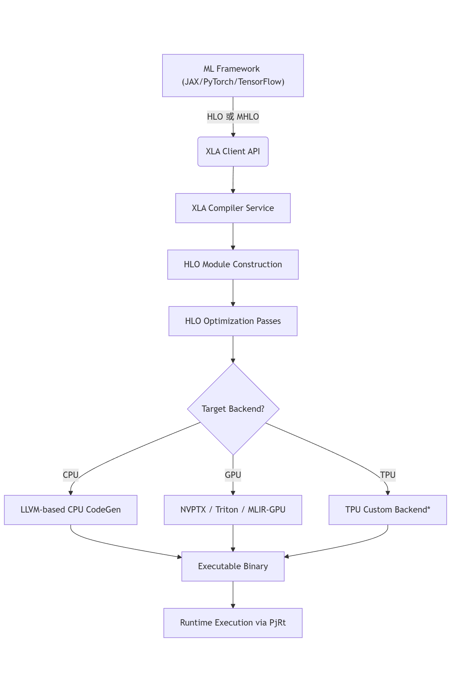

# 大创前期工作总结  
**日期**：2026年1月14日  
**作者**：罗植意  

## 一、OpenXLA 核心代码结构分析

分析了 `openxla` 核心代码的基础构成，`xla/` 目录下的文件结构如下：
```
xla/
├── hlo/ # HLO (High-Level Optimizer) IR 定义与操作
│ ├── ir/ # HLO 指令、计算图、操作符定义（C++）
│ └── transforms/ # HLO 层级的优化 Pass（如代数简化、融合等）
├── service/ # XLA 编译服务核心逻辑
│ ├── cpu/ # CPU 后端实现（LLVM-based）
│ ├── gpu/ # GPU 后端实现（基于 CUDA/ROCm/Triton 等）
│ │ ├── nvptx/ # NVIDIA PTX 代码生成
│ │ └── llvm_gpu/ # 基于 MLIR 的新 GPU 编译路径
│ ├── interpreter/ # HLO 解释器（用于调试）
│ ├── compiler/ # 主编译流程入口（HloModule → Executable）
│ └── shape_inference/ # 形状推导逻辑
├── mlir/ # XLA 与 MLIR 集成
│ ├── hlo/ # MLIR dialect for HLO（mhlo, chlo）
│ └── passes/ # MLIR 层的优化与 Lowering Pass
├── client/ # 用户接口层（如 LocalClient, PjRtClient）
│ └── xla_client.h # 提供给前端框架的 API
├── execution_profile/ # 性能分析工具
├── literal/ # XLA 张量数据表示
├── shape/ # Shape、Layout 等定义
├── tests/ # 测试
└── tools/ # 调试工具（如 hlo_runner）
```

- **主要模块调用流程：**

## 二、开发环境搭建

由于 Windows 上的 WSL 虚拟 Ubuntu 存在系统兼容性与功能限制，已在电脑上安装 Ubuntu 物理机，并配置 1TB 硬盘用于 XLA 编译部署。

编译过程中遇到以下问题及解决方案：

- **Bazel 版本问题**：直接安装 Bazel 可能无法识别路径，改用 `bazelisk` 并通过 `.bazelversion` 自动下载指定版本。
- **依赖缺失**：从华为 OBS 下载预编译依赖包，手动复制到 Bazel 缓存目录。
- **构建命令**：
  - Release 版本：
    ```bash
    bazel build //xla/...
    ```
  - Debug 版本：
    ```bash
    bazel build -c dbg --strip=never --subcommands \
      --host_cxxopt="-Wno-mismatched-tags -ggdb -O0 -g3" \
      --copt="-ggdb -O0 -g3" \
      --verbose_failures --spawn_strategy=local --test_output=all //xla/...
    ```

## 三、硬件限制

实验电脑未配备 NVIDIA 显卡，因此 **不支持 CUDA**，无法编译 GPU 后端。

## 后续工作方向
- 重点研究/xla/hlo和/tool文件下面的代码，了解XLA的编译流程和优化方法的有关函数。
- 分析/xla/BUILD文件，了解XLA的编译依赖关系。
